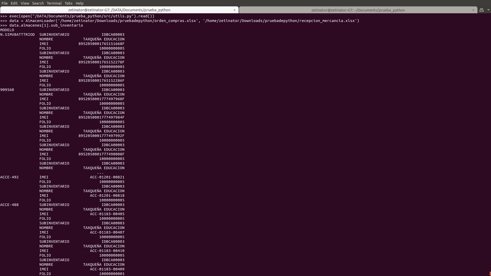
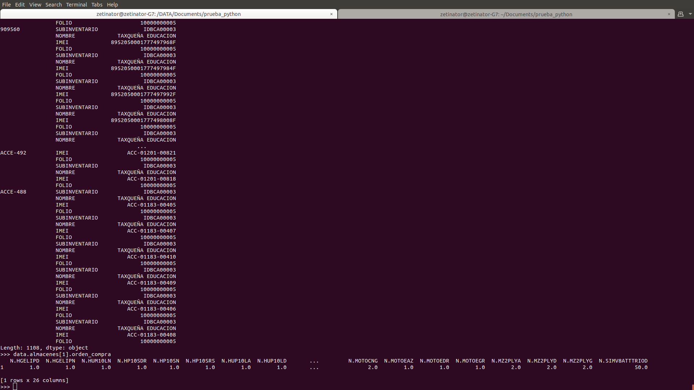

# Prueba de python
a empresa Ilusiones S.A. de C.V. vende equipos celulares y necesita realizar compras de mercancía a través de 2 archivos que envía la empresa matriz y que corresponden a 2 archivos: un archivo Excel de Orden de Compras y otro archivo Excel de Recepción de Mercancía.

## Dependencias adicionales
- Python 3.7
- Pandas
- Numpy

## Uso
Abrir una terminal en la raiz del proyecto (donde este archivo `README.md` se encuentra) y abrir un interprete de python con el comando `pyhton3` seguido de los siguientes commandos:

```python
exec(open(".../prueba_python/src/utils.py").read())
data = AlmacenLoader('.../pruebadepython/orden_compras.xlsx', '.../pruebadepython/recepcion_mercancia.xlsx')
data.almacenes[1].sub_inventario
data.almacenes[1].orden_compra
```
El output de los dos ultimos comandos representan el sub_inventario del segundo almacen y su orden de compra respectivamente tras leer los archivos de `orden_compras.xlsx` y `recepcion_mercancia.xlsx`.




